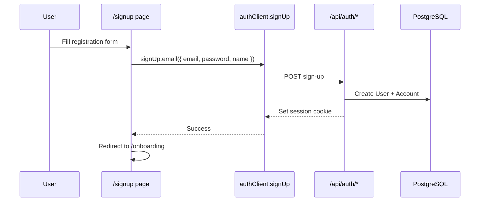
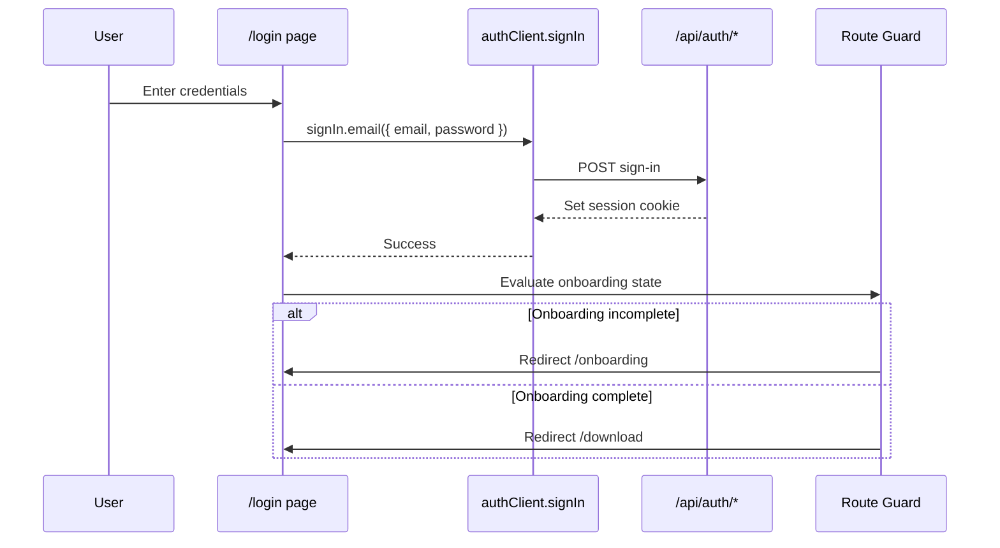
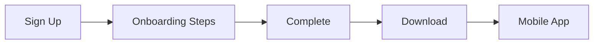

# Authentication Flow

**Contract status:** Binding for auth implementation.

**Sources:** [implementation/WEBSITE_USER_FLOWS.md](../implementation/WEBSITE_USER_FLOWS.md), [implementation/ENGINEERING_DECISIONS.md](../implementation/ENGINEERING_DECISIONS.md), Better Auth integration in codebase

**Stack:** Better Auth + Prisma adapter + `nextCookies` plugin

---

## Components

| Layer | Location |
|-------|----------|
| Server auth instance | `src/server/auth/index.ts` |
| API handler | `src/app/api/auth/[...all]/route.ts` |
| Client | `src/features/auth/client.ts` |
| Auth pages | `src/app/(auth)/*` |
| Route guards | `src/middleware.ts` *(planned)* |

---

## Sign Up

### Flow



### Requirements

- Collect: email, password, name *(TODO: confirm fields)*
- Terms acceptance checkbox with links to `/terms` and `/privacy`
- Guest-only route — redirect authenticated users
- On success: create session, redirect to `/onboarding`

### Error states

- Duplicate email
- Weak password (policy **TODO**)
- Network failure

---

## Login

### Flow



### Requirements

- Link to `/forgot-password` and `/signup`
- Guest-only route
- Post-login redirect per global redirect matrix

---

## Email Verification

### Status

Should Have — assumption in [MVP.md](../MVP.md). **TODO:** Confirm if required before onboarding.

### Flow

```mermaid
flowchart TD
    A[Sign Up success] --> B{Verification required?}
    B -->|Yes| C[/verify-email page]
    B -->|No| D[/onboarding]
    C --> E[User clicks email link]
    E --> F[Better Auth verifies token]
    F --> G[Redirect to /onboarding]
```

### `/verify-email` page

- Display verification status (pending, success, expired)
- Resend verification action *(if Better Auth supports)*

---

## Password Reset

### Priority

Should Have ([ROADMAP.md](../ROADMAP.md))

### Flow

```mermaid
flowchart TD
    A[/login] --> B[/forgot-password]
    B --> C[Submit email]
    C --> D[Better Auth sends reset email]
    D --> E[User clicks reset link]
    E --> F[Better Auth reset page or /login with token]
    F --> G[New password submitted]
    G --> H[/login with success message]
```

### Requirements

- `/forgot-password` — email input only
- Do not reveal whether email exists (security)
- Reset link handled by Better Auth

**TODO:** Confirm reset link landing route and UI ownership.

---

## Session Refresh

### Mechanism

Better Auth manages session lifecycle via HTTP-only cookies.

### Server read

- Server Components and Server Actions call Better Auth server API to read session
- `nextCookies` plugin syncs cookies for Server Actions ([ENGINEERING_DECISIONS.md](../implementation/ENGINEERING_DECISIONS.md))

### Client read

- `useSession()` for UI display
- Session refresh handled by Better Auth client — do not implement manual refresh

### Expiry

- Expired session: redirect to `/login` with return URL
- Onboarding routes: treat expired session as unauthenticated

---

## Logout

### Flow

```
User clicks Sign Out
    → authClient.signOut()
    → POST /api/auth/sign-out
    → Clear session cookie
    → Redirect to /
```

### Requirements

- Sign Out available when authenticated (**TODO:** header location)
- Idempotent — no error if already logged out

---

## Protected Routes

### Route classes

| Class | Routes | Requirement |
|-------|--------|-------------|
| Public | Marketing, blog, legal | None |
| Guest only | `/login`, `/signup`, `/forgot-password` | No active session |
| Authenticated | `/onboarding/*` | Valid session |
| Onboarding incomplete | `/onboarding/*` | Session + onboarding not complete |
| Onboarding complete | `/onboarding/*` blocked | Redirect to `/download` |

### Enforcement layers

1. **Middleware** (`src/middleware.ts`) — primary redirect matrix
2. **Layout guards** — backup check in `(onboarding)/layout.tsx`
3. **Server Actions** — session check before mutations

```mermaid
flowchart TD
    R[Request] --> M{middleware.ts}
    M -->|Public| OK[Allow]
    M -->|Guest route + session| REDIR1[Redirect by state]
    M -->|Onboarding + no session| REDIR2[/login]
    M -->|Onboarding complete + /onboarding/*| REDIR3[/download]
```

**TODO:** Implement middleware matcher config for route groups.

---

## Onboarding Gate

Onboarding is post-auth, pre-app-download.



### Rules

- Cannot skip onboarding in v1 ([USER_FLOW.md](../USER_FLOW.md))
- Resume at last incomplete step
- Do not repeat onboarding on login unless explicit restart (**TODO**)

### Session + onboarding check

Server must read:

1. Valid session (Better Auth)
2. Onboarding profile `completedAt` (onboarding service)

Both required for `/download` personalized state.

---

## Redirect Matrix (Authoritative)

| Condition | Request path | Action |
|-----------|--------------|--------|
| No session | `/onboarding/*` | → `/login?callbackUrl=...` |
| Session, onboarding incomplete | `/signup` | → `/onboarding` |
| Session, onboarding incomplete | `/login` | → `/onboarding` |
| Session, onboarding complete | `/onboarding/*` | → `/download` |
| Session | `/login`, `/signup` | → `/download` *(TODO: confirm landing)* |
| No session | Guest routes | Allow |

---

## Security Requirements

- HTTP-only session cookies (Better Auth default)
- `BETTER_AUTH_SECRET` server-only
- CSRF protection via Better Auth
- Rate limit auth endpoints — **TODO**
- Password minimum requirements — **TODO**
- No credentials in URL query params except OAuth callbacks

---

## Mobile Handoff

- Same User record and session token strategy for mobile — **TODO:** document token exchange when mobile phase begins
- Website creates account; mobile logs in with same credentials
- Onboarding data linked by `userId`

---

## TODO Summary

- [ ] Email verification required before onboarding?
- [ ] Password policy definition
- [ ] Logged-in landing route when onboarding complete
- [ ] Restart onboarding UX
- [ ] Middleware implementation details
- [ ] Rate limiting approach
